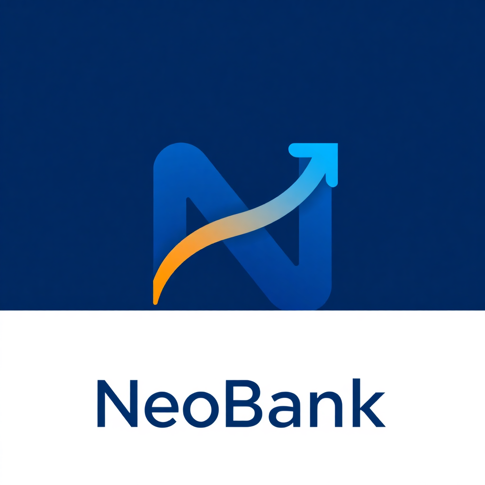

<p align="center">
  
</p>

<h1 align="center">NeoBank — Digital Banking Platform</h1>

<p align="center">
  A full-stack digital banking application with React + TypeScript frontend, Spring Boot 3 backend, and MySQL database.
</p>

<p align="center">
  <strong>Developed by Manish Kumar Samal</strong>
</p>

<p align="center">
  <a href="#-features">Features</a> •
  <a href="#-tech-stack">Tech Stack</a> •
  <a href="#-quick-start">Quick Start</a> •
  <a href="#-documentation">Documentation</a> •
  <a href="#-deployment">Deployment</a>
</p>

---

## ✨ Features

### 👤 Customer
- **Dashboard** — Real-time account balances, charts, and recent transactions
- **Transfer Funds** — Send money to beneficiaries or by account number
- **Deposit / Withdraw** — Self-service cash management
- **Transaction History** — Complete audit trail with status tracking
- **Beneficiaries** — Manage saved payees
- **My Accounts** — View all accounts with details and interest rates
- **E-Statements** — Generate and download account statements
- **KYC Verification** — Submit documents for identity verification
- **Analytics** — Spending breakdown, income vs expenses, trends
- **Profile Management** — Update personal info and change password
- **Loans** — View loan products and apply

### 🏦 Teller
- **Customer Search** — Find customers by name or email
- **Account Management** — Create accounts, freeze/unfreeze
- **Cash Operations** — Deposit and withdraw on behalf of customers

### 🛡️ Admin
- **User Management** — Create, edit, suspend, or delete users
- **Account Oversight** — View all accounts system-wide
- **Transaction Monitoring** — View all transactions, filter failures
- **KYC Administration** — Verify or reject identity documents

---

## 🛠 Tech Stack

### Frontend
| Technology | Purpose |
|------------|---------|
| **React 18 + TypeScript** | Component-based UI |
| **Vite 5** | Build tool & dev server |
| **shadcn/ui** (Radix primitives) | Accessible UI components |
| **TanStack React Query** | Server state & caching |
| **Zustand + Redux Toolkit** | State management |
| **React Router v6** | SPA routing |
| **Recharts / Chart.js** | Financial charts |
| **Framer Motion** | Animations |
| **Axios** | HTTP client with JWT interceptor |
| **Tailwind CSS** | Utility-first styling |

### Backend
| Technology | Purpose |
|------------|---------|
| **Java 25** | Programming language |
| **Spring Boot 3.4** | REST API framework |
| **Spring Security** | Authentication & authorization |
| **Spring Data JPA** | Database access |
| **JWT (jjwt)** | Token-based auth |
| **MySQL 8.0** | Relational database |

---

## 🚀 Quick Start

### Option 1: Demo Mode (No Backend)

```bash
# Install dependencies
npm install

# Start with demo mode (data stored in browser localStorage)
VITE_DEMO_MODE=true npm run dev
```

Visit **http://localhost:5173**

### Option 2: Full Stack with Docker

```bash
# Start all services
docker compose up -d

# Access
# Frontend: http://localhost:3000
# Backend API: http://localhost:8080/api
```

### Option 3: Full Stack (Manual)

```bash
# Terminal 1: Start MySQL (if not running)
mysql -u root -p

# Terminal 2: Start Backend
cd neobank-backend
mvn spring-boot:run

# Terminal 3: Start Frontend
npm run dev
```

### Demo Credentials

| Role | Email | Password |
|------|-------|----------|
| 👤 Customer | alice@neobank.com | password123 |
| 👤 Customer | bob@neobank.com | password123 |
| 🏦 Teller | teller@neobank.com | teller123 |
| 🛡️ Admin | admin@neobank.com | admin123 |

---

## 📚 Documentation

All documentation is in the [`docs/`](./docs) directory:

| Document | Description |
|----------|-------------|
| [ER Diagram](./docs/ER-DIAGRAM.md) | Database entity-relationship diagram with all tables |
| [Architecture](./docs/ARCHITECTURE.md) | System architecture, component breakdown, and data flow |
| [API Documentation](./docs/API-DOCUMENTATION.md) | Complete API reference with request/response examples |
| [Postman Collection](./docs/POSTMAN_COLLECTION.json) | Importable Postman collection with all endpoints |
| [Test Cases](./docs/TEST-CASES.md) | 42 test cases covering all features and edge cases |
| [Deployment Guide](./docs/DEPLOYMENT-GUIDE.md) | Deployment options (Docker, Vercel, Netlify, Railway) |
| [Project Demonstration](./docs/PROJECT-DEMONSTRATION.md) | Full feature walkthrough with demo script |

---

## 📁 Project Structure

```
neobank/
├── src/                          # Frontend (React + TypeScript)
│   ├── components/               # UI components
│   │   ├── ui/                   # shadcn/ui components
│   │   ├── layout/               # App layout, sidebar
│   │   └── features/             # Feature-specific components
│   ├── pages/                    # Page components
│   ├── services/                 # API services & mock adapter
│   ├── lib/                      # Utilities & mock data
│   ├── hooks/                    # Custom React hooks
│   ├── contexts/                 # React contexts
│   └── types/                    # TypeScript type definitions
├── neobank-backend/              # Backend (Spring Boot + Java)
│   └── src/main/java/com/neobank/
│       ├── controller/           # REST controllers
│       ├── service/              # Business logic
│       ├── repository/           # JPA repositories
│       ├── model/                # Entity models
│       ├── dto/                  # Data transfer objects
│       ├── config/               # Configuration classes
│       └── security/             # JWT & security filters
├── docs/                         # Documentation
├── docker-compose.yml            # Full-stack Docker setup
├── Dockerfile                    # Frontend Dockerfile
└── nginx.conf                    # Nginx configuration
```

---

## 🔧 Environment Variables

### Frontend
| Variable | Description |
|----------|-------------|
| `VITE_DEMO_MODE` | Set to `true` to run without backend |
| `VITE_API_BASE_URL` | Backend URL (for production) |

### Backend
| Variable | Description |
|----------|-------------|
| `SPRING_DATASOURCE_URL` | MySQL connection string |
| `SPRING_DATASOURCE_USERNAME` | MySQL username |
| `SPRING_DATASOURCE_PASSWORD` | MySQL password |
| `JWT_SECRET` | JWT signing secret (256-bit) |
| `APP_CORS_ORIGINS` | Allowed CORS origins |

---

## 🌐 Deployment Options

| Platform | Mode | Instructions |
|----------|------|--------------|
| **Vercel** | Demo | Set `VITE_DEMO_MODE=true` in environment |
| **Netlify** | Demo | Set `VITE_DEMO_MODE=true` in environment |
| **Docker Compose** | Full Stack | `docker compose up -d` |
| **Railway** | Full Stack | Add MySQL plugin, set env vars |
| **Manual** | Full Stack | Build JAR + build frontend + configure nginx |

See [Deployment Guide](./docs/DEPLOYMENT-GUIDE.md) for detailed instructions.

---

## 🧪 Test Coverage

42 test cases covering:

- ✅ Authentication (login, register, password validation)
- ✅ Account management (view, lookup, edge cases)
- ✅ Transactions (transfer, deposit, withdraw, insufficient funds)
- ✅ Beneficiaries (CRUD operations)
- ✅ Teller operations (create account, deposit, withdraw, freeze)
- ✅ Admin operations (user management, KYC verification)
- ✅ KYC submission and verification workflow
- ✅ Profile and password management
- ✅ Navigation and role-based access
- ✅ Real-time cross-tab synchronization

See [Test Cases](./docs/TEST-CASES.md) for complete details.

---

## 📸 Screenshots

| Preview | Page | Description |
|--------|------|-------------|
|  | **Landing Page** | Hero carousel, features, stats, testimonials |
|  | **Login** | Split-screen design with banking background |
|  | **Dashboard** | Account cards, charts, recent transactions |
|  | **My Accounts** | All user accounts with details and balances |
|  | **Transactions** | Complete transaction history with statuses |
|  | **Transfer** | Beneficiary / account number selection |
|  | **Beneficiaries** | Saved payees with CRUD operations |
|  | **Profile** | Personal info and password management |
|  | **KYC Upload** | Document submission for identity verification |
|  | **Teller Center** | Customer search and account operations |
|  | **Admin Console** | User management, KYC verification |
|  | **Analytics** | Spending charts and financial insights |

---

## 👨‍💻 Developer

**Manish Kumar Samal**

