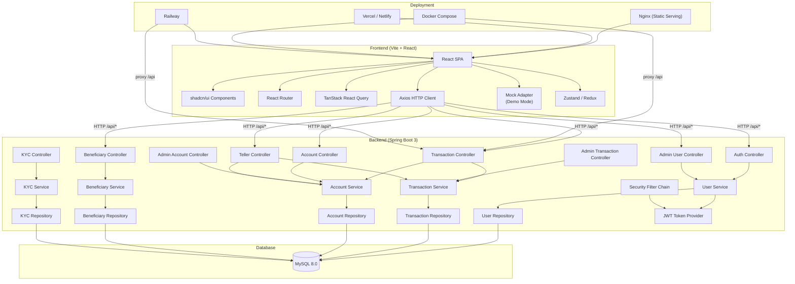

# NeoBank — Architecture Diagram

## System Overview

NeoBank is a full-stack digital banking application with a **React + TypeScript frontend**, a **Spring Boot 3 (Java 25) backend**, and a **MySQL database**. The application supports three user roles: **Customer**, **Teller**, and **Admin**.

---

## Architecture Diagram (Mermaid)



---

## Component Breakdown

### Frontend (React + TypeScript + Vite)

| Layer | Technology | Purpose |
|-------|-----------|---------|
| **UI Framework** | React 18 + TypeScript | Component-based UI |
| **Build Tool** | Vite 5 | Fast dev server & production builds |
| **Routing** | React Router v6 | SPA routing with role-based navigation |
| **HTTP Client** | Axios | API communication with JWT interceptor |
| **State** | Zustand + Redux Toolkit | Global state management |
| **UI Kit** | shadcn/ui (Radix primitives) | Accessible, themeable components |
| **Data Fetching** | TanStack React Query | Server state & caching |
| **Charts** | Recharts + Chart.js | Financial analytics & dashboards |
| **Animations** | Framer Motion + CSS | UI transitions & micro-interactions |
| **Forms** | React Hook Form + Zod | Type-safe form validation |
| **Real-time** | BroadcastChannel API | Cross-tab data sync |

### Backend (Spring Boot 3 + Java 25)

| Layer | Technology | Purpose |
|-------|-----------|---------|
| **Framework** | Spring Boot 3.4.4 | REST API framework |
| **Language** | Java 25 | Modern Java features |
| **ORM** | Spring Data JPA (Hibernate) | Database access |
| **Auth** | Spring Security + JWT (jjwt) | Authentication & authorization |
| **Validation** | Jakarta Validation | Request validation |
| **Database** | MySQL 8.0 | Relational data store |

### Frontend Pages & Routes

| Route | Page | Role Access |
|-------|------|-------------|
| `/` | Landing Page | Public |
| `/login` | Login | Public |
| `/register` | Registration | Public |
| `/dashboard` | Dashboard | All authenticated users |
| `/transfer` | Transfer Funds | Customer |
| `/deposit` | Deposit | Customer |
| `/withdraw` | Withdraw | Customer |
| `/transactions` | Transaction History | All authenticated users |
| `/beneficiaries` | Manage Beneficiaries | Customer |
| `/accounts` | My Accounts | Customer |
| `/statements` | E-Statements | Customer |
| `/kyc` | KYC Upload | Customer |
| `/loans` | Loans | Customer |
| `/analytics` | Analytics | Customer |
| `/profile` | Profile | All authenticated users |
| `/services` | Services Demo | Customer |
| `/teller` | Teller Center | Teller |
| `/admin` | Admin Console | Admin |

### API Endpoints

| Prefix | Controller | Description |
|--------|-----------|-------------|
| `/api/auth` | AuthController | Login, Register |
| `/api/accounts` | AccountController | Account CRUD, Lookup |
| `/api/transactions` | TransactionController | Transfer, Deposit, Withdraw |
| `/api/beneficiaries` | BeneficiaryController | Beneficiary CRUD |
| `/api/users` | UserController | Profile, Password |
| `/api/kyc` | KYC Controller | KYC Document Management |
| `/api/teller` | TellerController | Teller operations |
| `/api/admin` | AdminController | Admin operations |

---

## Data Flow

```
User Action → React Component → Service Layer (Axios) 
→ [API Request] → Spring Boot Controller → Service 
→ Repository → MySQL → Response → UI Update
```

### Authentication Flow

```
User submits credentials → AuthController.login() 
→ UserService.login() → verify password (BCrypt) 
→ JwtTokenProvider.generateToken() → return JWT 
→ Frontend stores token in localStorage 
→ Axios interceptor attaches Bearer token to all requests
```

### Transfer Flow

```
User fills transfer form → TransactionService.transfer() 
→ Validate sender account → Validate beneficiary/account number 
→ Validate balance → Debit sender → Credit receiver 
→ Create 2 transaction records (sender OUT / receiver IN) 
→ Return response → Frontend refreshes balances and transactions
```

---

## Demo Mode

When `VITE_DEMO_MODE=true`, the Axios adapter is swapped with a **Mock Adapter** that serves data from localStorage (seeded from `mockData.ts`). This enables the app to run entirely in the browser without any backend or database — perfect for demos, development, and static hosting (Vercel, Netlify).

**Seed Users:**

| Email | Password | Role |
|-------|----------|------|
| alice@neobank.com | password123 | Customer |
| bob@neobank.com | password123 | Customer |
| teller@neobank.com | teller123 | Teller |
| admin@neobank.com | admin123 | Admin |
| emma@neobank.com | password123 | Customer (suspended) |
| akash@neobank.com | password123 | Customer |
