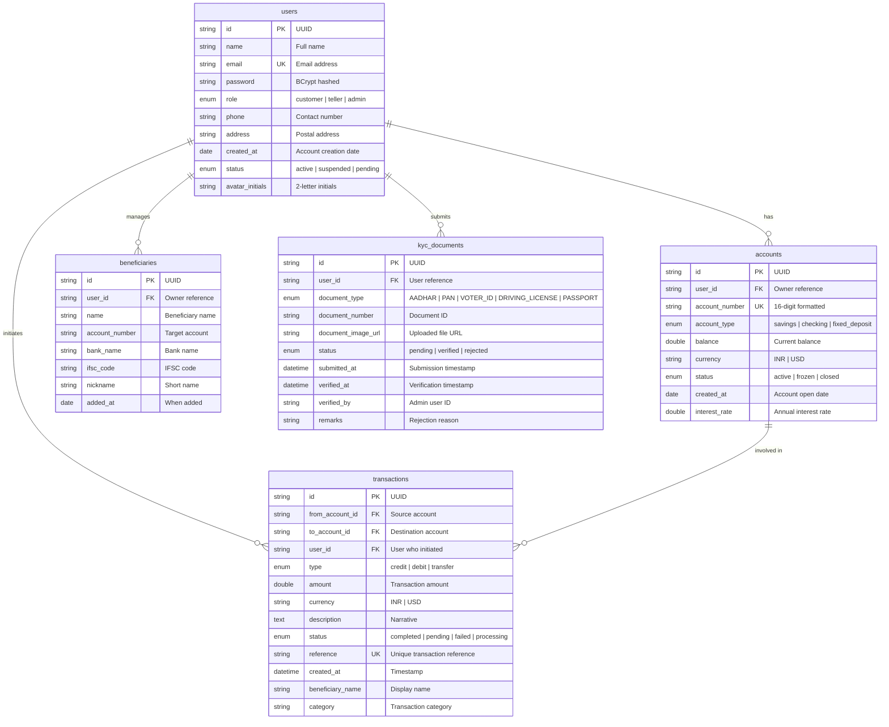

# NeoBank — Entity Relationship Diagram (ERD)

## Database Overview

NeoBank uses **MySQL** as its primary database with the following entities: `users`, `accounts`, `transactions`, `beneficiaries`, and `kyc_documents`.

---

## Entity Relationship Diagram (Mermaid)

---

## Table Descriptions

### `users`
Stores all user accounts (customers, tellers, and admins). Passwords are hashed using BCrypt. Each user has a role that determines their permissions in the application.

### `accounts`
Bank accounts linked to users. Supports three account types with different interest rates. Account numbers follow a 16-digit format (e.g., `4521-8736-1092-3847`). Balances are updated atomically during transactions.

### `transactions`
Records every financial event. Each transaction tracks the source account, destination account, and the user who initiated it. For transfers, two records are created (one debit/transfer for sender, one credit for receiver). Statuses include `completed`, `pending`, `failed`, and `processing`.

### `beneficiaries`
Saved payees for quick transfers. Linked to a user and stores the target account details. Supports IFSC codes and nicknames for easy identification.

### `kyc_documents`
Know Your Customer documents submitted by users. Supports multiple document types (Aadhar, PAN, Voter ID, Driving License, Passport). Documents go through a verification workflow (pending → verified/rejected).

---

## Indexes

| Table | Index | Columns | Purpose |
|-------|-------|---------|---------|
| `users` | `idx_users_email` | `email` | Fast login lookup |
| `accounts` | `idx_accounts_user` | `user_id` | Fetch user's accounts |
| `accounts` | `idx_accounts_number` | `account_number` | Account number lookup |
| `transactions` | `idx_txns_user` | `user_id` | Fetch user's transactions |
| `transactions` | `idx_txns_reference` | `reference` | Unique reference lookup |
| `beneficiaries` | `idx_beneficiaries_user` | `user_id` | Fetch user's beneficiaries |
| `kyc_documents` | `idx_kyc_user` | `user_id` | Fetch user's KYC docs |
