# NeoBank — Project Demonstration

## Overview

NeoBank is a full-stack digital banking platform that provides a complete online banking experience for customers, tellers, and administrators. This document walks through all major features of the application.

**Demo Credentials:**

| Role | Email | Password |
|------|-------|----------|
| Customer | alice@neobank.com | password123 |
| Customer (2) | bob@neobank.com | password123 |
| Teller | teller@neobank.com | teller123 |
| Admin | admin@neobank.com | admin123 |
| Customer (suspended) | emma@neobank.com | password123 |

---

## 1. Landing Page (`/`)

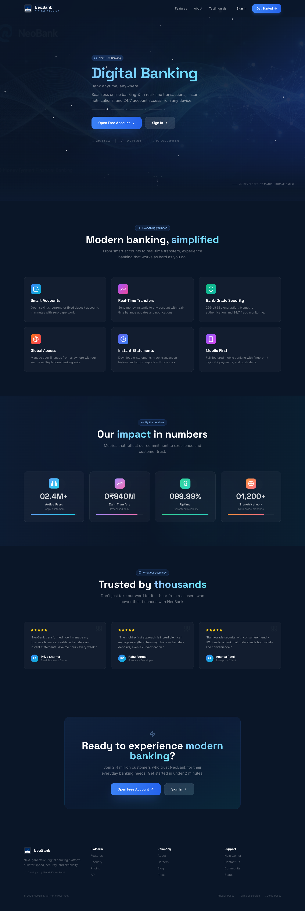
*NeoBank landing page with hero carousel and navigation*

The landing page serves as the public-facing homepage with:

- **Navigation Bar** — Logo, nav links (Features, About, Testimonials), Sign In / Get Started buttons
- **Hero Carousel** — Auto-rotating banners showcasing: Digital Banking, Smart Savings, Global Transfers, Secure Platform
- **Features Section** — 6 feature cards (Smart Accounts, Real-Time Transfers, Bank-Grade Security, etc.)
- **Stats Section** — Animated counters with progress bars (2.4M+ Users, ₹840M Daily Transfers, 99.99% Uptime, 1,200+ Branches)
- **Testimonials** — 3 user reviews with star ratings and gradient avatars
- **CTA Section** — "Ready to experience modern banking?" call-to-action
- **Footer** — Brand info, links, and developer credit

---

## 2. Authentication

### Login (`/login`)

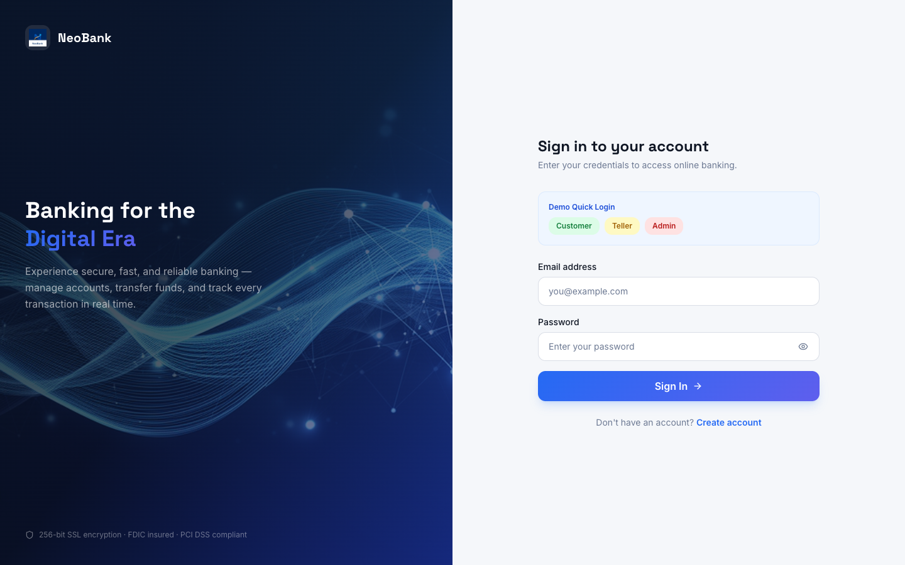
*Login page with split-screen design and quick login buttons*

- Split-screen design: banking hero image (left) + login form (right)
- Quick login buttons for Customer, Teller, and Admin roles
- Show/hide password toggle
- Error handling for invalid credentials and suspended accounts

### Registration (`/register`)
- Full registration form (name, email, password, phone, address)
- Auto-creates a savings account upon successful registration
- Redirects to dashboard immediately

---

## 3. Customer Dashboard (`/dashboard`)

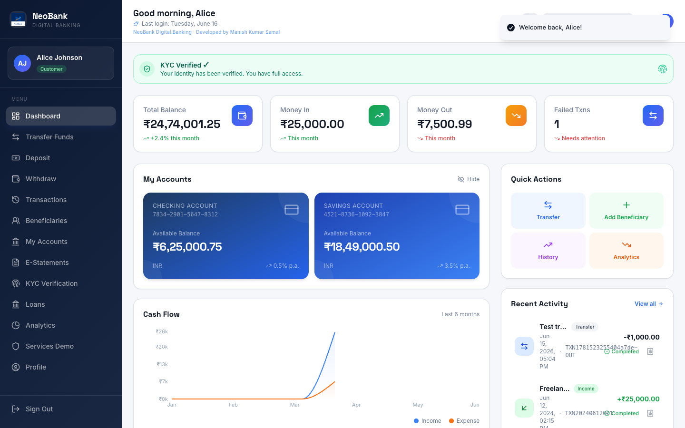
*Customer dashboard with account cards, balance chart, and recent transactions*

The central hub for customers with:

- **Account Cards** — All accounts displayed with type, number, balance, and status badges
- **Quick Actions** — Transfer, Deposit, Withdraw buttons for common tasks
- **Recent Transactions** — Last 5 transactions with status indicators
- **Balance Chart** — Visual representation of balance over time using Recharts
- **Spending Chart** — Category-based spending breakdown (pie/donut chart)
- **Real-time Updates** — Cross-tab sync via BroadcastChannel API

---

## 4. Money Transfers (`/transfer`)

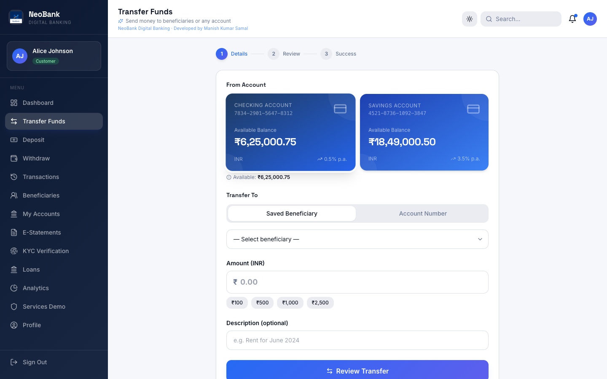
*Transfer page with beneficiary and account number options*

- **Transfer To:**
  - **Beneficiary Tab** — Select from saved beneficiaries
  - **Account Number Tab** — Type any 16-digit account number with real-time validation
- **From Account** — Select from user's accounts
- **Amount** — Input with minimum validation
- **Description** — Optional memo/note
- **Review & Confirm** — Two-step confirmation flow
- **Real-time Updates** — Both sender and receiver see updated balances

---

## 5. Deposits & Withdrawals

### Deposit (`/deposit`)
- Select account to deposit into
- Enter amount
- Instant credit to account balance
- Transaction recorded in history

### Withdraw (`/withdraw`)
- Select account to withdraw from
- Enter amount (validated against balance)
- Instant debit from account balance
- Transaction recorded in history

---

## 6. Transaction History (`/transactions`)

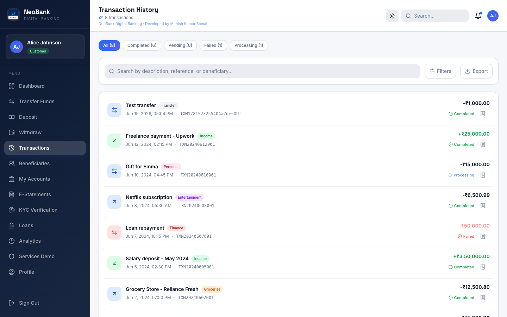
*Transaction history with status badges and filtering*

- Complete list of all transactions (most recent first)
- Each row shows: date, type (credit/debit/transfer), amount, status, description
- Status badges: Completed (green), Pending (yellow), Failed (red), Processing (blue)
- Responsive table layout

---

## 7. Beneficiaries (`/beneficiaries`)

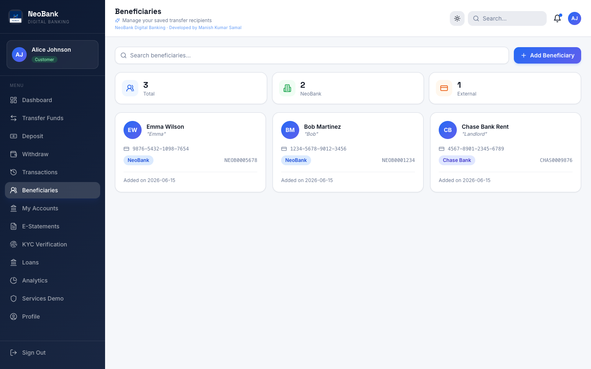
*Beneficiaries management page*

- List of saved payees with account details
- Add new beneficiary (name, account number, bank name, IFSC, nickname)
- Edit beneficiary details
- Delete beneficiary with confirmation
- Real-time updates

---

## 8. Account Management (`/accounts`)

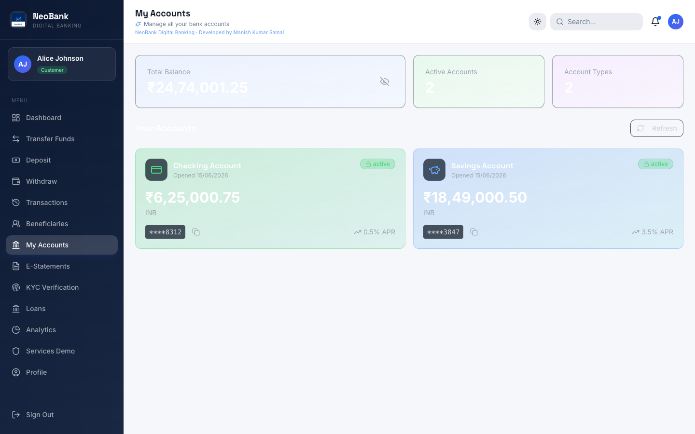
*Account management page with detailed account cards*

- All user accounts displayed as detailed cards
- Shows: account type, number, balance, status, interest rate, created date
- Status badges (active/frozen/closed)

---

## 9. KYC Verification (`/kyc`)

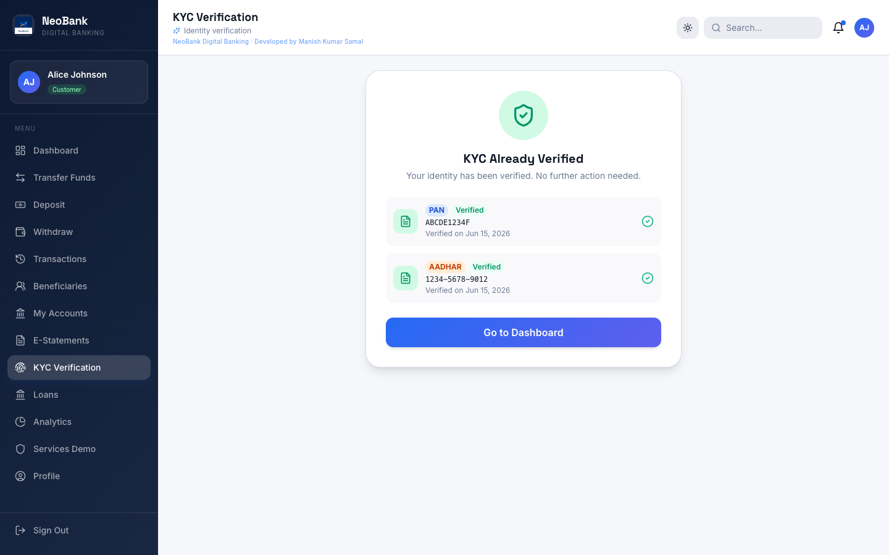
*KYC document submission page*

- Select document type (Aadhar, PAN, Voter ID, Driving License, Passport)
- Enter document number
- Submit for verification
- View submission status (pending/verified/rejected)
- Admin handles verification/rejection in admin console

---

## 10. Analytics (`/analytics`)

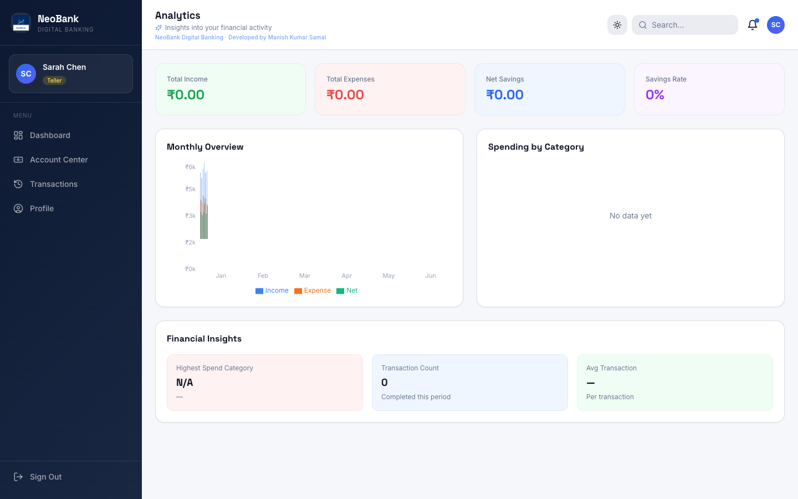
*Analytics page with financial charts and spending breakdown*

- **Balance Over Time** — Line chart showing balance trends
- **Income vs Expenses** — Bar chart comparing inflows and outflows
- **Category Breakdown** — Pie chart of spending by category
- **Monthly Trends** — Monthly transaction volume analysis
- Interactive charts with hover tooltips

---

## 11. Teller Center (`/teller`)

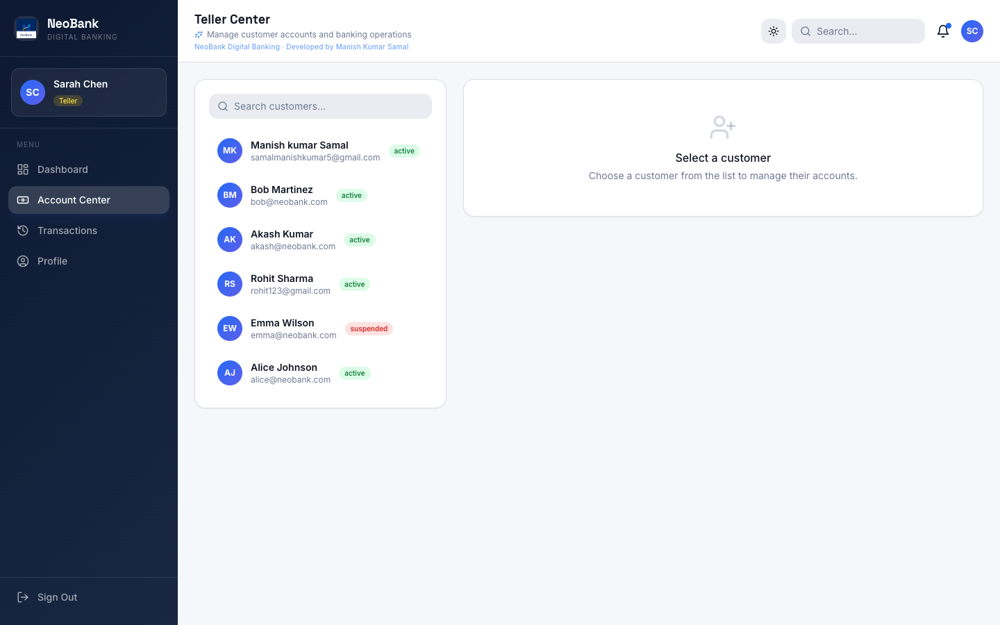
*Teller Center with customer management and cash operations*

For bank tellers to assist customers:

- **Customer List** — Searchable list of all customers
- **Account Management:**
  - Create new account (savings/checking/fixed_deposit)
  - Freeze/unfreeze accounts
  - View all customer accounts
- **Cash Transactions:**
  - Deposit cash into customer account
  - Withdraw cash from customer account
- **Transaction History** — View customer transactions
- **Real-time Sync** — All changes reflected across browser tabs

---

## 12. Admin Console (`/admin`)

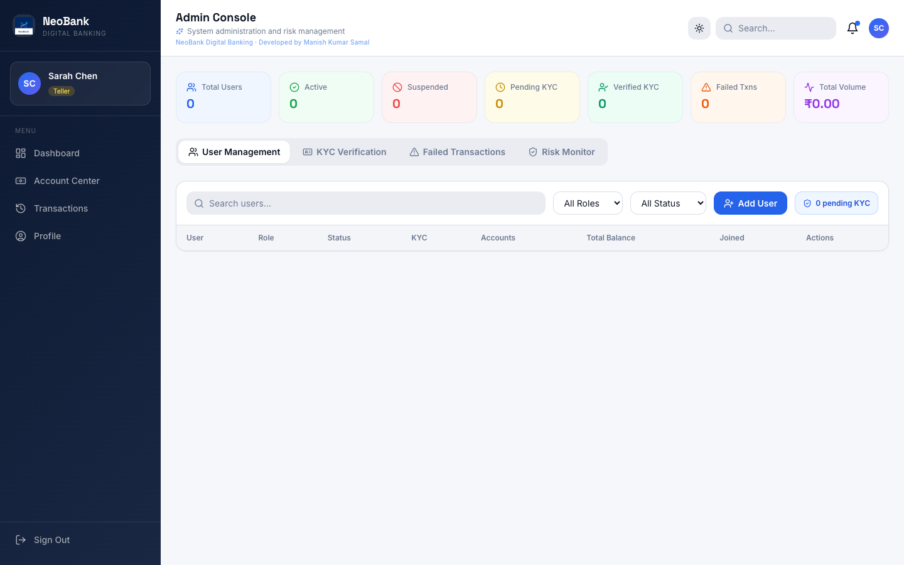
*Admin console with user management and KYC verification*

Full administrative control:

### Users Tab
- View all users with search/filter
- Create new users (auto-creates account)
- Edit user details
- Toggle active/suspended status
- Delete users (with cascading data removal)
- Real-time status updates

### Accounts Tab
- View all accounts across all users
- Filter by status or type
- View account details

### Transactions Tab
- View all system transactions
- Filter by status
- Failed transactions view

### KYC Tab
- View all submitted KYC documents
- Pending documents queue
- Verify or reject documents with remarks
- KYC statistics (pending/verified/rejected counts)

---

## 13. Profile Management (`/profile`)

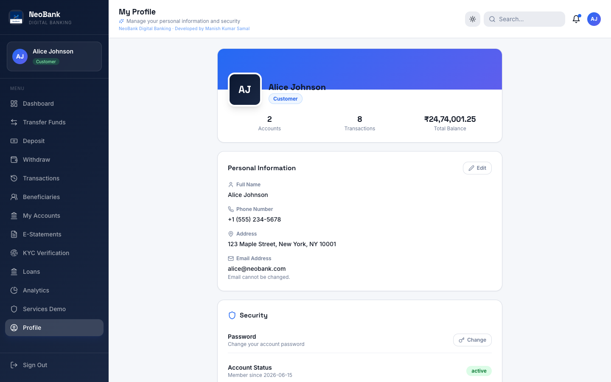
*Profile management page*

- View and edit personal information
- Change password with current password verification
- Profile updates reflected immediately

---

## 14. Additional Features

### E-Statements (`/statements`)
- Generate account statements
- Filter by date range
- PDF download option
- Transaction categorization

### Loans (`/loans`)
- View available loan products
- Loan calculator
- Apply for loans
- Track loan status

### Services Demo (`/services`)
- Showcase of integrated services
- Interactive demonstrations
- API integration examples

---

## 15. Technical Highlights

### Frontend
- **React 18 + TypeScript** — Type-safe component architecture
- **Vite 5** — Fast HMR and optimized builds
- **shadcn/ui** — Accessible, themeable component library
- **TanStack React Query** — Server state caching and refetching
- **Zustand + Redux Toolkit** — State management
- **Recharts / Chart.js** — Interactive financial charts
- **Framer Motion** — Smooth animations and transitions
- **React Router v6** — Role-based routing with guards
- **BroadcastChannel API** — Cross-tab data synchronization
- **Custom Hook System** — `useServiceSync`, `useRealtimeRefresh`, `useScrollReveal`

### Backend (Spring Boot)
- **Java 25 + Spring Boot 3.4** — Modern enterprise framework
- **Spring Security + JWT** — Secure authentication and authorization
- **Spring Data JPA / Hibernate** — ORM with MySQL
- **Role-based Access Control** — Customer, Teller, Admin permissions
- **Atomic Transactions** — Credit/debit operations wrapped in `@Transactional`
- **RESTful API** — Clean, consistent endpoint design
- **JPA Repositories** — Efficient database access with custom queries

### Database (MySQL)
- **5 tables** — users, accounts, transactions, beneficiaries, kyc_documents
- **Indexed fields** — Fast lookups on email, account number, user IDs
- **UUID primary keys** — Distributed-friendly ID generation
- **Enum types** — Type-safe status and category fields

### Demo Mode
- **Mock Adapter** — In-browser API simulation
- **localStorage** — Persistent data without a database
- **Seed Data** — 6 users, 5 accounts, 10 transactions, 4 beneficiaries, 2 KYC documents
- **Zero Configuration** — Just set `VITE_DEMO_MODE=true` and run

---

## Developer

**Developed by Manish Kumar Samal**

---

## Demo Walkthrough Video Script

1. **Start** → Show landing page with hero carousel auto-rotating
2. **Scroll down** → Features section → Stats with animated counters → Testimonials
3. **Navigate to Login** → Use quick login as Alice (Customer)
4. **Dashboard tour** → Account cards → Balance chart → Recent transactions
5. **Transfer** → Send money to a beneficiary → Show success
6. **Logout** → Login as Teller → Show Teller Center
7. **Teller** → Create account → Deposit → Withdraw
8. **Logout** → Login as Admin → Show Admin Console
9. **Admin** → Users tab → Transactions tab → KYC verification
10. **Profile** → Update profile → Change password
